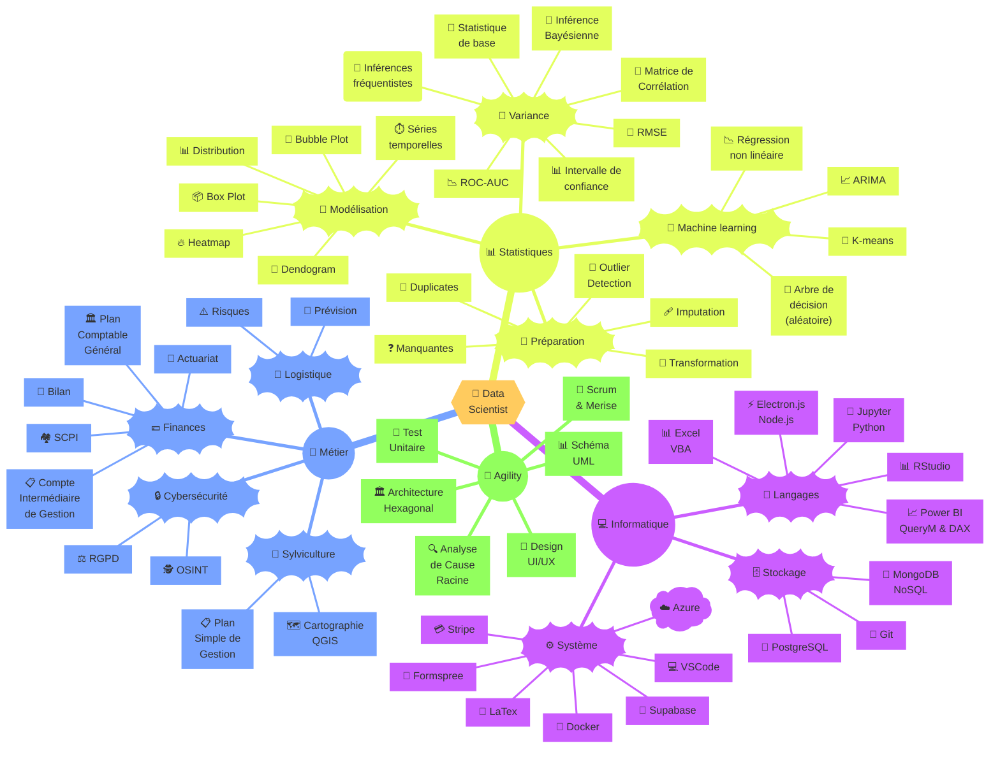

# Enseignement

<!--
Ce README est conçu comme un modèle réutilisable pour vos futurs projets.
Il intègre les meilleures pratiques et explications détaillées pour faciliter
la compréhension et l'adaptation.

GUIDE D'UTILISATION DE CE README :
ADAPTATION POUR VOS PROJETS :
- Remplacer [PLACEHOLDERS] par vos informations
- Supprimer les commentaires HTML en production
- Ajouter des badges pertinents (build status, couverture tests, etc.)
- Adapter la structure selon votre type de projet
- Traduire si nécessaire (ce template est en français)

RESSOURCES :
- Guide Markdown : https://www.markdownguide.org/
- Awesome README : https://github.com/matiassingers/awesome-readme
- Shields.io : https://shields.io/ (badges)

-->

<table align="center"><tr>
  <td> </td>
  <td></td>
  <td></td>
  <td></td>
  <td></td>
</tr></table>

<!--
DESCRIPTION COURTE (quote block ci-dessus) :
- Maximum 2 lignes
- Résume l'essence du projet
- Utilise des emojis pour rendre visuellement attractif
- Répond à "Qu'est-ce que c'est ?" en 10 secondes
-->

📚 Dépôt de ressources pédagogiques et guides pratiques pour l'apprentissage et des bonnes pratiques de développement.

## 📋 Table des matières

<!--
La table des matières facilite la navigation dans les longs README.
Utilisez des ancres Markdown (#section-name) pour créer des liens internes.
-->

1. [À propos](#-à-propos)
1. [Structure du projet](#-structure-du-projet)
1. [Documentation](#-documentation)
1. [Utilisation](#-utilisation)
1. [Licence](#-licence)
1. [Contact](#-contact)
1. [Remerciements](#-remerciements)
1. [Notes additionnelles](#-notes-additionnelles)

---

## 🎯 À propos

<!--
Cette section explique le POURQUOI du projet.
Répondez aux questions :
- Quel problème résout-il ?
- Qui est l'audience cible ?
- Qu'est-ce qui le rend unique/utile ?
-->

### Contexte

Ce dépôt centralise des **ressources pédagogiques complètes** pour l'apprentissage de technologies essentielles en développement logiciel. Il est conçu pour :

- **Étudiants** : Apprendre Git, PowerShell et les bonnes pratiques dès le départ
- **Développeurs débutants** : Acquérir des bases solides avec des guides détaillés
- **Formateurs** : Utiliser comme support de cours ou base de documentation
- **Équipes** : Standardiser les pratiques de développement

### Objectifs

- ✅ Fournir des guides étape par étape, testés et maintenus
- ✅ Couvrir les outils essentiels
- ✅ Documenter les standards de structuration de projets
- ✅ Servir de modèle réutilisable pour futurs projets
- ✅ Encourager les bonnes pratiques dès le début

### Technologies couvertes

| Technologie | Niveau | Contenu |
|-------------|--------|---------|
| **Git** | Débutant à Intermédiaire | Installation, configuration, workflows, branches, résolution conflits |
| **PowerShell** | Débutant | Commandes de base, automatisation (en développement) |
| **Python** | Débutant | Configuration, variables d'environnement, scripts d'automatisation |
| **Standards projet** | Tous niveaux | Structure de répertoires, conventions de nommage, fichiers essentiels |

---

## 📁 Structure du projet

<!--
Cette section documente l'organisation du dépôt.
Utilisez un arbre ASCII ou des listes pour clarté.
Expliquez le rôle de chaque dossier/fichier principal.

LÉGENDES RECOMMANDÉES :
📄 Fichier Markdown / texte
📂 Dossier
🐍 Fichier Python
📓 Notebook Jupyter
📦 Package / Module
⚙️ Fichier de configuration
🧪 Tests
📚 Documentation
🚀 Scripts de déploiement

ALTERNATIVES :
- Utiliser des icônes textuelles (comme ci-dessus)
- Utiliser tree en ASCII pur (│ ├── └──)
- Générer avec la commande `tree` (Windows/Linux)
-->

## 📖 Documentation

<!--
Liste organisée de toute la documentation disponible.
Groupez par thème et indiquez le niveau de difficulté.
-->

### Ressources externes

<!--
Listez les ressources tierces de qualité que vous recommandez.
Indiquez la langue si ce n'est pas l'anglais.
-->

- 📘 [Pro Git](https://git-scm.com/book) par Scott Chacon et Ben Straub
- 🛠️ [Contributor Covenant](https://www.contributor-covenant.org/) pour le modèle de Code de Conduite
- 🎨 [Awesome README](https://github.com/matiassingers/awesome-readme) pour les bonnes pratiques de README
- 🔧 [GitKraken](https://www.gitkraken.com/) pour l'extension GitLens
- 🏫 [GitHub Education](https://education.github.com/) pour les ressources pédagogiques

## 💻 Utilisation

<!--
Cette section montre des exemples concrets d'utilisation.
Fournissez des cas d'usage courants avec commandes copy-paste.
-->

## 📜 Licence

<!--
Choisissez une licence appropriée et expliquez ce qu'elle permet.
-->

Ce projet est sous licence **Attribution-NonCommercial-ShareAlike 4.0 International** — voir le fichier [LICENSE](LICENSE) pour plus de détails.

[Qu'est-ce que cela signifie ?](https://creativecommons.org/licenses/by-nc-sa/4.0/)

<!-- [AUTRES LICENCES COURANTES](F:\Enseignement\standards\Licence-arbre.md) -->

## 📧 Contact

<!--
Facilitez la communication avec les mainteneurs.
Proposez plusieurs canaux selon les types de demandes.
-->

### Mainteneur principal

**WyloW2Ricard0**
- 🐙 GitHub : [@WyloW2Ricard0](https://github.com/WyloW2Ricard0)
- 📧 Email : wrichard@live.fr
- 💬 Discussions : [GitHub Discussions](https://github.com/WyloW2Ricard0/Enseignement/discussions) (recommandé pour questions publiques)

<!--
CONSEIL : Privilégiez GitHub Discussions/Issues pour les questions techniques
(réponses publiques = aide toute la communauté). Réservez l'email pour
les demandes privées ou sensibles.
-->

### Comment me contacter ?

| Type de demande | Canal recommandé | Temps de réponse |
|-----------------|------------------|------------------|
| 🐛 Bug / erreur | [Issues](https://github.com/WyloW2Ricard0/Enseignement/issues) | 24-48h |
| 💡 Suggestion | [Issues](https://github.com/WyloW2Ricard0/Enseignement/issues) | 48-72h |
| ❓ Question technique | [Discussions](https://github.com/WyloW2Ricard0/Enseignement/discussions) | 48-72h |
| 🤝 Collaboration | Email | 3-5 jours |
| 🚨 Incident Code de Conduite | Email privé | 24h |

<!--
Activez GitHub Discussions dans les paramètres du dépôt :
Settings → Features → ✓ Discussions
-->

---

## 🙏 Remerciements

<!--
Remerciez les personnes et projets qui ont inspiré ou aidé.
Cela crée de la bonne volonté et encourage la collaboration.
-->

### Inspirations et ressources

### Contributeurs

<!--
Listez les contributeurs (GitHub génère automatiquement la liste si vous utilisez all-contributors bot).
Ou manuellement :
-->

Un grand merci à tous les contributeurs qui ont aidé à améliorer ce projet :

<!-- Sera complété au fur et à mesure des contributions -->

<!--
AUTOMATISER AVEC ALL-CONTRIBUTORS :
https://allcontributors.org/

Ajoute automatiquement un badge et une table des contributeurs.
-->

### Soutien

⭐ Si ce projet vous a aidé, n'hésitez pas à lui donner une étoile sur GitHub !
🐦 Partagez-le sur les réseaux sociaux pour aider d'autres apprenants.
💬 Laissez un commentaire dans les [Discussions](https://github.com/WyloW2Ricard0/Enseignement/discussions) pour partager votre expérience.

---

## 📌 Notes additionnelles

<!--
Section optionnelle pour informations complémentaires.
-->

### État du projet

🚧 **En développement actif** — De nouvelles ressources sont ajoutées régulièrement (voir [Roadmap](#-roadmap)).

### Fréquence de mise à jour

<!--
- **Contenu :** Mise à jour continue selon les contributions
- **README :** Révision mensuelle
- **Dépendances/liens :** Vérification trimestrielle
-->

### Compatibilité

| Système | Statut | Notes |
|---------|--------|-------|
| Windows 10/11 | ✅ Testé | Commandes PowerShell 5.1+ |
| macOS | ✅ Compatible | Adapter commandes pour Terminal/Zsh |
| Linux (Ubuntu/Debian) | ✅ Compatible | Adapter commandes pour Bash |

### Versions recommandées

<!--
CONSEIL : Indiquez les versions minimales requises et testées.
Exemple : "Git 2.30+, VS Code 1.70+, Python 3.8+"
-->

Avant de commencer, assurez-vous d'avoir installé :

- **Git** : 2.30+ (versions antérieures peuvent fonctionner) [Télécharger ici](https://git-scm.com/)
- **VS Code** : 1.70+ (pour support complet GitLens) [Télécharger ici](https://code.visualstudio.com/)
- **Python** : 3.8+ (pour notebooks) [Télécharger ici](https://www.python.org/)

---

**📚 Bon apprentissage ! 🚀**

Fait avec ❤️ par [WyloW2Ricard0](https://github.com/WyloW2Ricard0)

<!--
FIN DU README

CHECKLIST FINALE AVANT PUBLICATION :
- [ ] Tous les liens fonctionnent
- [ ] Les commandes ont été testées
- [ ] Pas de typos ou fautes d'orthographe majeures
- [ ] Les badges affichent les bonnes informations
- [ ] Le fichier LICENSE existe
- [ ] Le CODE_OF_CONDUCT.md existe
- [ ] .gitignore est configuré
- [ ] Structure de répertoires correspond à la documentation
- [ ] Supprimer les commentaires HTML en production (ou les garder pour référence)

OUTILS UTILES :
- Vérificateur de liens : https://github.com/tcort/markdown-link-check
- Linter Markdown : https://github.com/markdownlint/markdownlint
- Prévisualisation : VS Code extension "Markdown Preview Enhanced"
- Badges : https://shields.io/
-->
