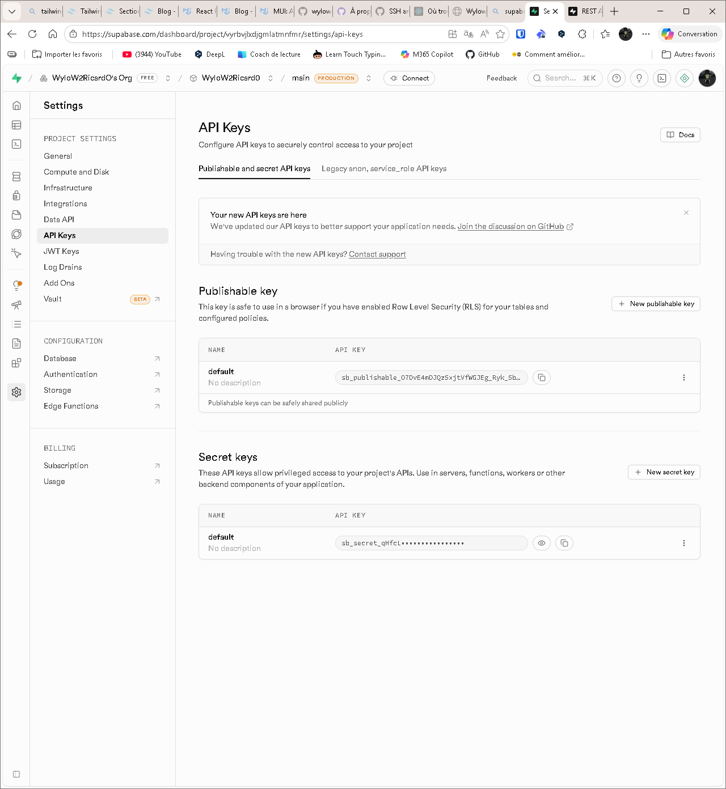

# Connectez-vous à votre projet

Le **client Supabase** est votre point d’entrée vers le reste des fonctionnalités Supabase.

C'est le moyen le plus simple d’interagir avec tout ce que nous proposons dans l’écosystème.

Vous pouvez initialiser un nouveau client Supabase en utilisant cette méthode.

```tsx
import { createClient } from '@supabase/supabase-js'

const supabase = createClient(
    process.env.SUPABASE_KEY*,
    process.env.SUPABASE_URL
)
```

## API REST Supabase : l'essentiel

- Supabase génère automatiquement une **API RESTful** à partir de votre schéma de base de données.
- L’**SUPABASE_URL** est : `https://<project_ref>.supabase.co/rest/v1/` ***disponibles dans*** section "Paramètres" > "General".
- L’API permet toutes les **opérations CRUD** (Créer, Lire, Mettre à jour, Supprimer) sur vos tables et vues.
- Les **modifications du schéma sont immédiatement** reflétées dans l’API.
- L’**API est sécurisée** par la sécurité au niveau des lignes (RLS) et l’authentification par clé API.
- La documentation de l’API et les clés sont disponibles dans le dashboard Supabase, **section « API »**.
- **Respect les droits et politiques de sécurité** définis dans Postgres.

## Clés API Supabase : l'essentiel

- Les clés API servent à **authentifier les applications** qui accèdent à votre projet Supabase.
- 2 types de clés :
	- **SUPABASE_PUBISH** (sb_publishable_) : à utiliser côté client (web, mobile, CLI), accès limité, exposable publiquement.
	- **SUPABASE_SECRET** (sb_secret_) : à utiliser uniquement côté serveur, accès complet, JAMAIS exposer publiquement.
- Les clés sont **disponibles dans** le dashboard Supabase, section "Paramètres" > "Clés API".
- Ne stockez **jamais de clés secrètes dans le code source** ou des environnements non sécurisés.
- Les clés API ***legacy anon*** et ***service_role*** (JWT) sont les **anciennes clés** générées par Supabase
- Combinez l’utilisation des clés avec Supabase Auth et les politiques de sécurité au niveau des lignes (RLS) pour une sécurité optimale.



## Ressource
Pour plus de détails ou d’exemples, consultez la [documentation officielle Supabase](https://supabase.com/docs/guides/api).
