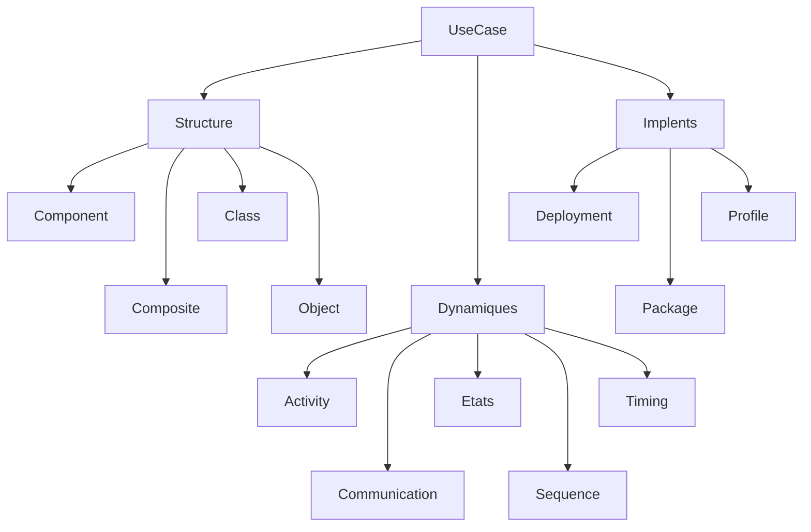

# Unified Modeling Language (UML)

UML vise à permettre l’interopérabilité entre les outils de modélisation, s’inscrit dans l’approche *MDA*.

Une opération UML définit ce qui doit se passer (post-condition) mais pas comment (comportement détaillé)

UML modélise un système en séparant deux types de sémantique, à l’aide d’un métamodèle standard basé sur *MOF* :

