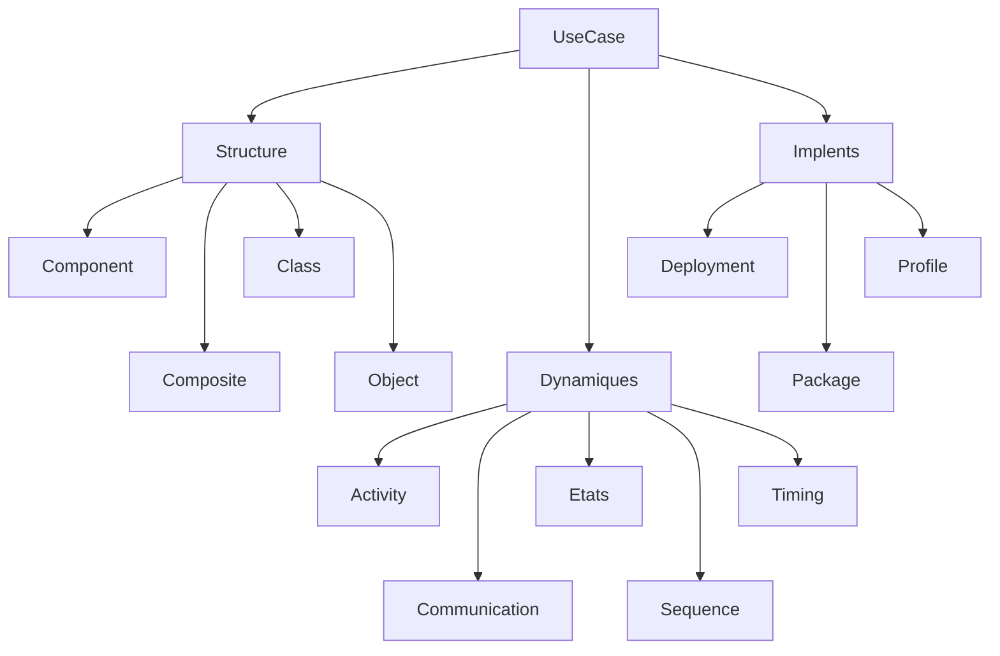

---
# Variable
showMiniToc: true
permissions: true
effectiveDate: 2026-05-28
image: "https://www.omg.org/images/logos/UML-logo.png"

# Content pour faciliter la recherche
title: Diagramme UML comme processus de conception
intro: Comment deduire les specification en fonction des besoin ?
type: Cours
topics:
  - data
  - Microsoft PBI

# Information
author: RICHARD Wilfried
featuredLinks:
  - prev:
  - next: "./uml1-seq.md"
  - mid:
  - exp: "https://www-lipn.univ-paris13.fr/~gerard/docs/cours/uml-cours-support.pdf"
  - ofi: "https://www.omg.org/spec/UML/2.5.1/PDF"
changelog:
  - 2026-07-05 : Creation du cours
  - 2026-07-06-08 : Completer l'intro
  - 2026-07-06-09 : Ajout de l'objectif
---

# Unified Modeling Language (UML)

UML hérite principalement des méthodes objets de Booch, OMT et OOSE.
Il intègre d'autres formalisemes, comme les machines à états de Hare.

UML fournit des notations ***standardisées*** pour analyser, spécifier, concevoir et documenter un système logiciel.
Un diagramme UML permet de rendre un système plus ***lisible*** pour les développeurs, les architectes et les clients.

Une opération UML définit ce qui doit être obtenu (post-condition) mais pas comment (comportement détaillé).
Un modèle UML peut être raffiné a chaque phases d'analyse du *cycle de vie du logiciel*.

UML modélise un système en séparant deux types de sémantique, à l’aide d’un métamodèle standard basé sur *MOF* :

## Objectif

UML propose beaucoup de diagrammes, leur ordre n’est pas imposé car le choix dépend de ce que l’on veut démontrer.

Dans mon usage, le besoin initial est souvent imprécis et le cahier des charges est incomplet.

Mon objectif est de construire progressivement un ***plan*** de programmation qui respecte l'*architecture hexagonale*.

J’utilise UML surtout en rétro-conception pour deux raisons :

- il fournit un vocabulaire commun ;
- il permet de descendre progressivement vers le code.

Pour moi, les diagrammes UML forment un *arbre de construction*.
Il sufit de suivre le plans.

L’objectif n’est pas un process *bijective* entre diagrammes et code.
L’objectif est de completer et ***structurer les besoin***.

> Comment definire les class, grace au norme UML ?
