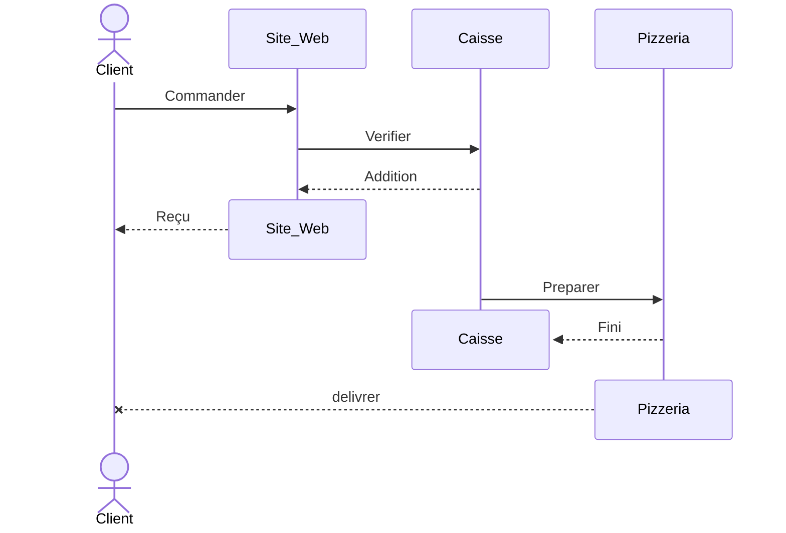

# Sequance

Le diagramme de Sequence (SEQ) permet d’identifier les **collaborations** nécessaires en observant les *Echanges* entre acteurs, dans l’ordre chronologique.

Une **ligne de vie** représente l’existence d’un *Intervenants*. ils ont chacun leur ligne ***verticale***, et les messages montrent les *Echanges* dans le ***temps***.

La **création** signifie qu’un objet ou participant ***apparaît*** pendant l’exécution du scénario.
La **destruction** signifie que l’objet ou participant ***termine son rôle*** dans le scénario.

Le diagramme *SEQ* est utilisé ici comme représentation des ***cas d’utilisation*** car il met en avant les **convertion** essentiel entre les *Intervenants*, sans perdre la logique grâce à son ordre chronologique.

## Legende

- **Intervenants** :
  - `actor` : acteur humain
  - `participant`: rôle externe
- **Echanges** :
  - `->>` **synchrone** : appel complet et attend.
  - `-->>` **réponse** : envoyée après un appel synchrone.
  - `-)` **asynchrone** : appel complet sans attendre de retour
  - `--)` **retour** : événement asynchrone
  - `->>()` **perdu** : envoi est connu, mais pas l’événement de réception.
  - `()->>` **trouvé** : réception est connu, mais pas l’événement d’émission.
  - `--x` **fin** possible
- **Cadre** :
  - `alt / else` : condition.
  - `loop` : répétition.
  - `par` : en parallele
  - `opt` : optionel
- `note over` : annotation.

## Exemple

Cas d'un commerce de pizza qui a decider d'avoir site web pour commander les pizza.
Vous ette donc embocher pour ameliorer leur site.

1. Ajouter tout les *Intervenants*
   - Mettre *actor* si c'est une personne
   - Mettre *participant* pour les autres
1. Regrouper les *Intervenants* de la pizzeria
   - Mettre a gauche les client
   - Mettre a droite les prestateur
1. Ajouter les *Echanges* entre les *Intervenants*
   - Que vas demander l'*Intervenants* a l'autre
1. Ajuster le type des *Echanges*
1. Optimiser la trajectoire des *Echanges*
   - Isolez vous au maximum des participant
   - Minimizer les fleche
1. Supprimer les ligne de vie une foit que vous les tiliser plus pour nettoyer.

> Rester dans les grandes ligne, vous aurais la possibilité d'ajouter des pressition dans les autres diagramme.

Dans le cadre de cette Pizzeria ;

1. Le ***Client*** va sur le site pour ***commander***
1. Il est decider que le Client ***paye*** sur le site pour suprimer le risque de fausse comande
1. La Caisse envoi la commande a la Pizzeria pour ***preparation***
1. Le Pizzeria ***delivre*** la Pizza

