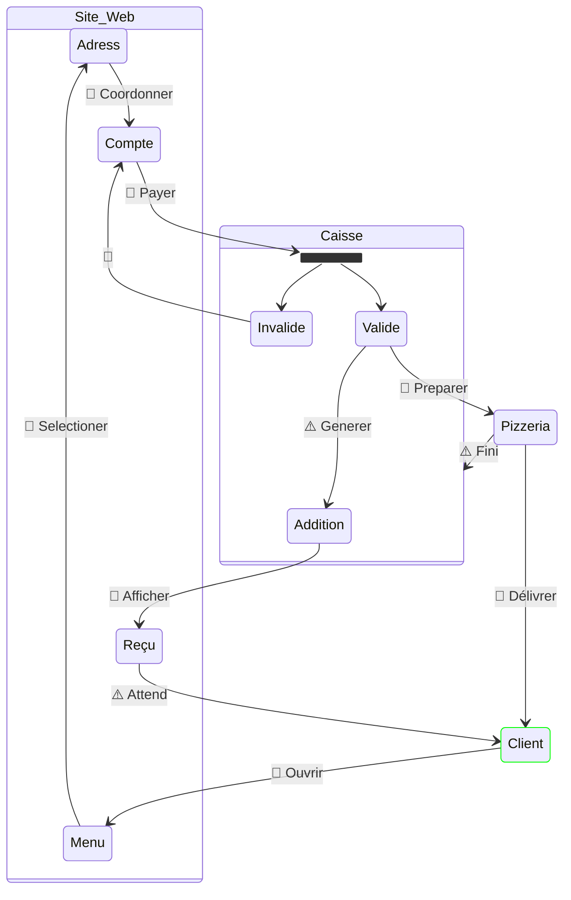

# State

Le diagramme d’état (STAT) permet d’identifier ***comment*** un *Intervenants* change d’état en réponse à des événements qui font évoluer le processus.

Un **Etat** représente une situation dans laquelle se trouve un *Intervenants* à un moment donné.

Un **Déclencheurs** représente la raison du passage d’un état à un autre.

Le STAT est construit apres le SEQ car il suit aussi un ordre chronologique.
Il permet d’éviter d’oublier les etapes.

## Legende

1. **Événements** : indiquent ce qui déclenche ou termine un processus.
   - **Début** : cercle simple `[*]`
   - **Fin** : cercle épais `[*]`
   - **Intermédiaire** : fin non cibler ; cercle double
1. **Déclencheurs** : évenement de transition.
   - **Cancel** : Annule une transaction ; 🚫
   - **Compensation** : Annule une action précédente ; 🔁
   - **Conditional** : Sous condition ; ✅
   - **Escalation** : allerte non bloquante ; ⚠️
   - **Error** : Erreur détectée ; ❌
   - **Link** : Connecte des parties du diagramme ; 🔗
   - **Message** : réception d’un message ; 📩
   - **Multiple** : Plusieurs déclencheurs possibles ; ➕
   - **Signal** : événement externe ; 📡
   - **Terminate** : Arrêt immédiat du processus ; 🛑
   - **Timer** : date / délai ; ⏱️
1. **Passerelles** : faire des choix ou des parallèles
   - **Exclusive** : choix multiple ; `<<choice>>`
   - **Inclusive** : choix unique ; `<<join>>`
   - **Parallel** : tous les chemins ; `<<fork>>`
1. **Annotation** : `note`

> Vous avez pas le choix des fleche dans mermaid

## Exemple

1. Mettre en premier les *Intervenant* dans l'ordre de SEQ
1. Mettre les *Echanges* entre ces *Intervenant*
1. Pour chaque *Intervenant* dans l'ordre:
   1. Identifier les *Etat*
   1. Ajouter les *Déclencheurs* entre les *Etat*
   1. Modifier les attache des *Echanges*
1. Mettre en couleur les *Etats*

> Nous avons fait aussi le Chef et le Pilote que nous pouvons pas programer pour mieux apreander les chemain des *collaborations*

Dans le cadre de cette Pizzeria ;

1. Le Client va sur le site pour commander
   1. Le Client ***ouvre*** le site
   1. il vas sur le ***menu***
   1. il rentre son ***adress***
1. Il est decider que le Client paye sur le site pour suprimer le risque de fausse comande
   1. La Caisse ***valide ou non*** le paiyement
1. La Caisse envoi la commande a la Pizzeria pour ***preparation***
   1. ***Recupere*** l'addition gere pa la Caisse
   1. ***Afficher*** au Client
1. Le Pizzeria ***delivre*** la Pizza

