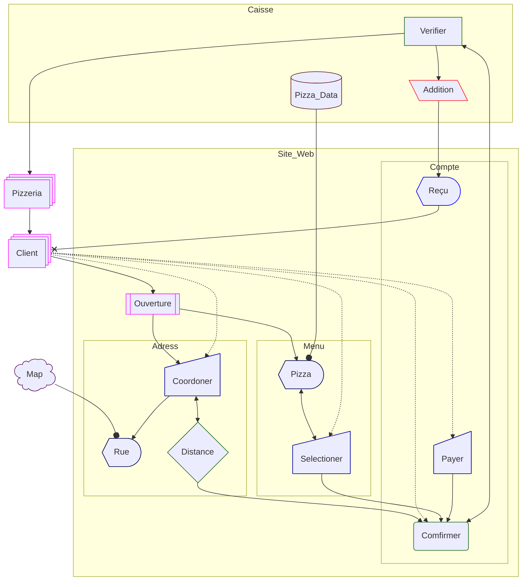

# Flow

Le diagramme de flux (FLOW) permet d’identifier ***ce que fait chaque partie*** du processuce.

Contrairement au SEQ, qui montre surtout l’ordre des communications, et au STAT, qui montre les états possibles, le FLOW détaille les traitements internes.

Il sert à definire les *Objets* utiliser pour realiser les *Echanges* et les *Déclancheurs*, car chaque *Etat* est defini comme un **Process** qu'il faut decrire.

> Je le trouve plus pratique que le diagramme des besoins car vous avez une liste difinie de forme, qui peut donnée de bonne ider.

## Legende

- **Relations** :
  - `-->` **Association** : relation simple entre deux *Objets*.
  - `--x` **Asynchrone** : appel complet sans attendre de retour
  - `--o` **Aggregation** : inclusion d’un élément dans un *Objets*.
  - `-.-` **Link (Dashed)** : lien qui permet de definire  des limite ; Ce n'ait pas a vous de definire les KPI
- **Objets** :
  - **Fontionnal**
    - `decision` : Decision ; Diamond
    - `delay` : Delay ; Rectangle
    - `div-proc` : Processus de division ; Rectangle divisé
    - `event` : Événement ; Rectangle arrondi <!-- - `junction` : Carrefour ; Cercle rempli- `fork` : Fork ; Rectangle rempli -->
    - `loop-limit` : Limite de boucle ; Pentagone trapézoïdal
    - `manual` : Fonctionnement manuel ; Sommet de la base trapézoïde
    - `prepare` : Préparer conditionnel ; Hexagone
    - `priority` : Action prioritaire ; Base du trapèze <!-- - `procs` : Multi-processus ; Rectangle empilé - `proc` : Processus : Rectangle -->
    - `stored-data` : Données stockées ; Rectangle à nœud papillon
    - `subproc` : Sous-processus ; Rectangle encadré
    - `tag-proc` : Processus balisé
  - **Physique**
    - `card` : carte ; Rectangle Cranté
    - `cloud` : Cloud
    - `das` : Stockage à accès direct ; Cylindre horizontal
    - `datastore` : Magasin de données
    - `database` : Base de données
    - `disk` : Stockage sur disque ; Cylindre à doublure
    - `doc` : Document
    - `docs` : Multi-documents ; Document empilé
    - `internal-storage` : Stockage interne ; Vitre
    - `lin-doc` : Document ligneé
    - `manual-file` : Dossier manuel ; Triangle inversé
    - `tag-doc` : Document balisé
  - **Interface**
    - `display` : Affichage ; Trapèze courbé
    - `extract` : Extrait ; Triangle
    - `in-out` : Entrée des données ; Penche à droite
    - `manual-input` : Entrée manuelle ; Rectangle incliné
    - `out-in` : Sortie des données ; Penche à gauche
    - `paper-tape` : Ruban en papier ; Drapeau
  - Autres
    - `bang`: Pan <!-- - `collate` : opération de collation ; Sablier - `com-link` : Communication ; Éclair -->
    - `comment` : Commentaire ; Attelle bouclée <!-- - `brace-r` : Commentaire ; Attelle droite - `braces` : Commentaire ;  attelles des deux côtés -->
    - `odd` : Étrange ; Forme impair
    - `summary` : Résumé ; Cercle croisé
    - `terminal` : Terminal Point ; Stade<!-- - `start` : Début ; Cercle- `circ` : Début ; Cercle - `stop` : Arrête ; Cercle encadré - `dbl-circ` : Arrête ; Double Cercle -->
    - `text` : Bloc de texte

## Exemple

1. Recopier STAT
1. Transformer le commantaire des action en *Object* pour le realiser.
1. Utiliser des *Etat* pour regrouper les *Object*
1. Ajouter les *Elements* nécéssaire ; rien vien de null part, tout ce transforme
1. Modifier les *Relation*

> Vous n'ette pas nécéssairement propritaire du stockage ; vous ajouterait ainsi des inteface metier (vous aller pas implementer tout les adress manuellement)

Dans le cadre de cette Pizzeria ;

1. Le Client va sur le site pour commander
   1. Le Client ***ouvre*** le site
      1. ***afficher*** le menu des ***Pizza*** qui se trouve deja dans la Caisse
   1. il vas sur le ***menu***
      1. ***Selection multiple*** les pizza du menu
   1. il rentre son ***adress***
      1. Le client ***recherche*** son adress
      1. Le Site verifie la ***distance***
1. Il est decider que le Client paye sur le site pour suprimer le risque de fausse comande
   1. La Caisse ***valide ou non*** le paiyement
      1. le client doit dabor ***confirmer*** si il a fini de completer
      1. Le Site doit ***interoger*** la Caisse
1. La Caisse envoi la commande a la Pizzeria pour ***preparation***
   1. ***Recupere*** l'addition gere pa la Caisse
   1. ***Afficher*** au Client
1. Le Pizzeria ***delivre*** la Pizza

