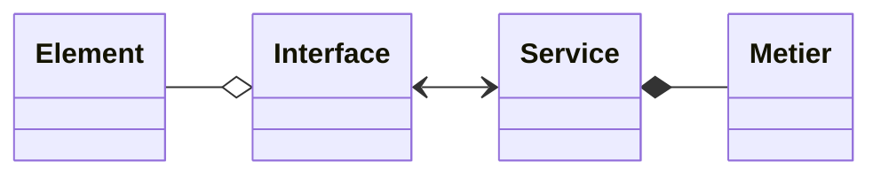
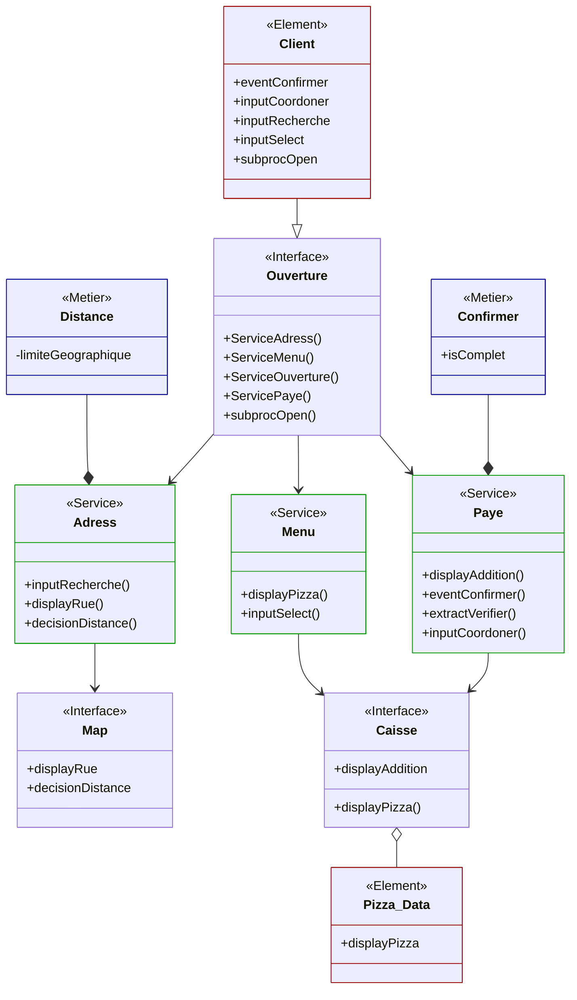

# Class

Le diagramme de classes (CLASS) permet de transformer l’analyse précédente en ***structure de programmation***.

Contrairement au SEQ, qui montre les échanges, au STAT, qui montre les états, et au FLOW, qui détaille les traitements, le CLASS définit les éléments à coder autour de :

- L'**Interface** entre un intervenant et le système ;
- le **Service** qui coordonne une action ou un scénario ;
- Les **Metier** qui réalise des action ;
- Les **Element** contenant les données importantes.

Pour une meilleur interabilité les relation sont predefini ;

Dans chaqu'une de ces class on defini les **atribut** qu'il genaire pour fonctioner et les **methode** géré.

## Legende

- **Encapsulation** :
  - `+` **public** : accessible partout.
  - `-` **private** : accessible uniquement dans la classe.
  - `#` **protected** : accessible dans la classe et ses enfants.
  - `~` **package** : accessible dans le package. [geeksforgeeks.org]
  - `*` **Abstract** :
  - `$` **Static** :
- **Relation**
  - `-->` **Dependence forte** : une classe utilise une autre classe
  - `-->` **Dependence faible** : utilisation ponctuelle ou technique
  - `o--` **Aggregation** : inclusion d’un élément dans un ensemble.
  - `*--` **Composition** : contenance structurelle entre instances ;  destruction de l’objet composite => destruction des objets composants.
  - `<|--` **Héritage** : une classe enfant récupère les attributs et méthodes d’une classe parent.
  - `..|>` **Realization**
  <!-- - `..` **Link (Dashed)**
  - `--` **Link (Solid)** : relation simple entre deux classes
  - `--()` **Lollipop** -->

## Exemple

1. Mettre le Client en *Element* (classe abstraite)
1. Mettre les *Interface*
1. Mettre une *Realization* entre le Client et les *Interface* lier
1. Mettre les *Porcess* en *Service*
1. Mettre une *Dependence fort* entre les *Interface* et les *Porcess* lier
1. Mettre les *Decision* et les **Event* en *Metier*
1. Mettre une *Composition* entre les *Porcess* et les *Metier*
1. Mettre les *Object* *Physique* en *Element*
1. Mettre une *Aggregation* entre les *Interface* et les *Element*
1. Mettre les *Methode* dans les *Service* en ***justaposant*** la fonction de l'*Objet* puis sont nom, des *objets* responsable
1. Mettre les *Methode* des *Interface* en justaposant "Service" puis sont nom, des *Service* qu'il démare
1. Mettre les *Methode* des *Service* dans les *Atributs* des *Interface* sans *Element* corespondant si non remetre dans la *Methode*
1. Ajouter les instance nécéssaire dans les *Metier*

> Remetre les *Object* permet de garder un lien entre le diagramme precedant et de le corriger si les nom ne vous semble pas coherent

Dans le cadre de cette Pizzeria on va ce concentre sur le site web ;

