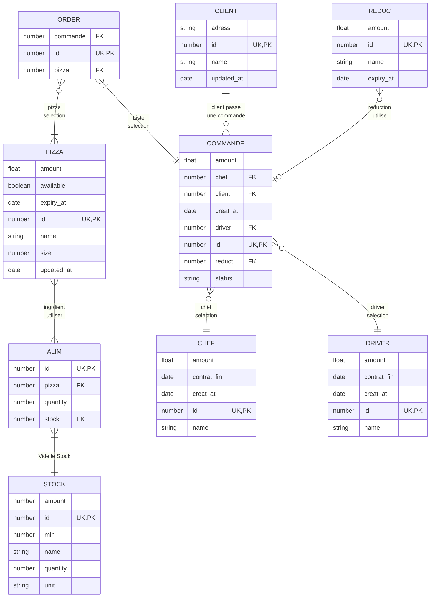

# Entity Relationship

On peut identifier les entités métier que le système doit enregistrer et manipuler.

> Le ER Diagram permet de représenter les données du système et leur les relations avec leur cardinalités.

## Methode

1.
1. Une foit fini vous pourait revenire sur le Requirement pour correction.

## Legende

- **Entity** : objet métier important du système ; exemple : CUSTOMER, ORDER, PIZZA.
- **Attribute** : propriété d’une entité ; exemple : name, price, status.
- **Relationship** : lien entre deux entités ; exemple : client passe une commande.
- **Cardinality** :
  - `o|` : zéro ou un
  - `||` : exactement un
  - `o{` : zero ou plusieurs
  - `|{` : un à plusieurs
- **Key** :
  - `PK` : Primary Key
  - `FK` : Foreign Key
  - `UK` : Unique Key

## Exemple

1. Un CLIENT peut passer plusieurs COMMANDES. un client peut avoir zéro ou plusieurs commandes ; une commande appartient à un seul client.
1. Une COMMANDE contient une ou plusieurs lignes de commande. Chaque ligne de commande correspond à une PIZZA sélectionnée. Cela permet de gérer plusieurs pizzas dans une même commande.
1. Une COMMANDE est associée à :
   1. un CHEF pour la préparation ;
   1. un DRIVER pour la livraison.
1. Une COMMANDE peut utiliser une REDUC. Cela signifie qu’une commande peut avoir zéro ou une réduction.
1. Une PIZZA est composée de plusieurs éléments ALIM.
1. Chaque élément ALIM consomme une ressource du STOCK.

