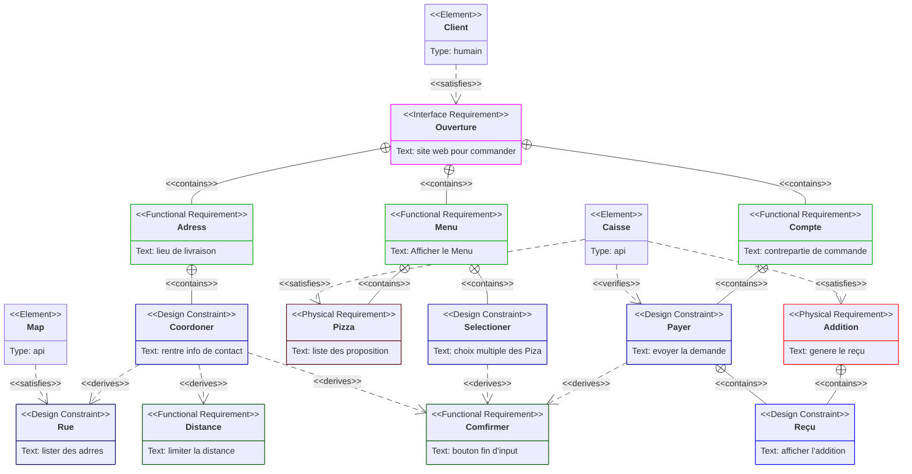

# Requirement

Le schema de Requirement permet de hierachiser les besoins, et d'ajouté le niveaux de risque et la methode de verification.

> je l'etuluse pour clarifier les autres diagramme et verifier q'uil ne manque rien

## Legende

- **Type** : Mettre de la couleur pour mieux les distinguer
  - `designConstraint` : contrainte de conception
  - `functionalRequirement` : liée à une action attendue
  - `interfaceRequirement` : échange externe
  - `performanceRequirement` : capacité ou rapidité
  - `physicalRequirement` :
  - `requirement` : exigence générale du système
- **Relations** :
  - `contains` : *exigence* contient une sous-exigence <!-- - `copies` -->
  - `derives` : *exigence* découle d’une autre
  - `refines` : *exigence* precise une autre
  - `satisfies` : *élément* satisfait par une *exigence*
  - `traces`: traçabilité entre éléments ou exigences
  - `verifies` : *élément* qui vérifie une *exigence*
- **Risques** :
  - `Low`
  - `Medium`
  - `High`
- **VerificationMethod** :
  - `Analysis`
  - `Inspection`
  - `Test`
  - `Demonstration`

## Exemple

